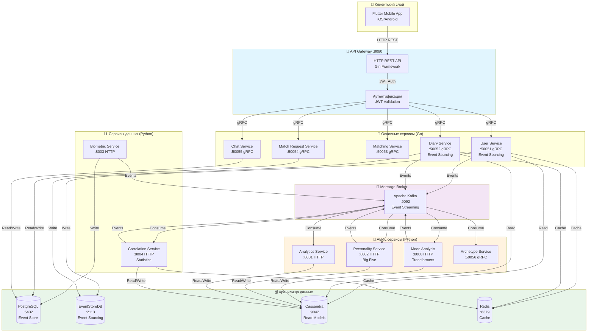
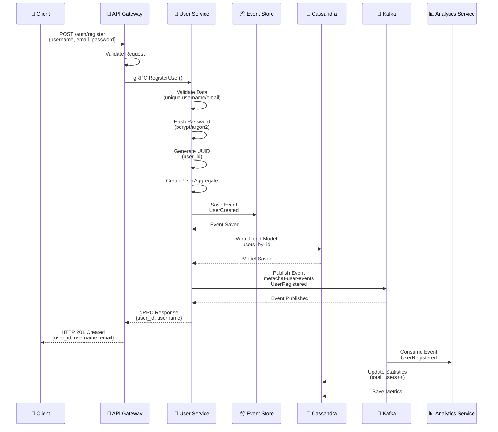
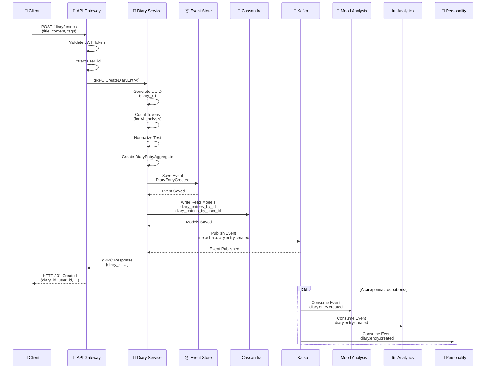
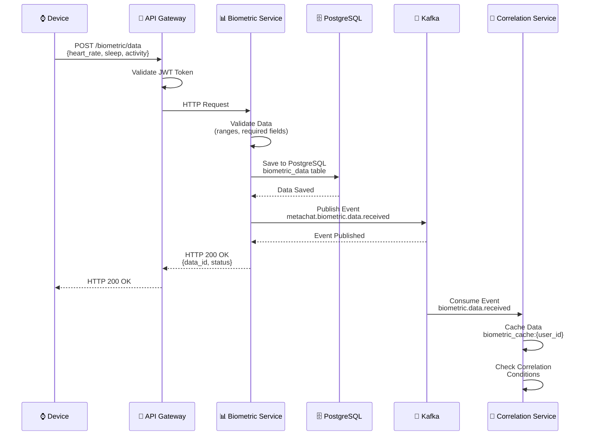
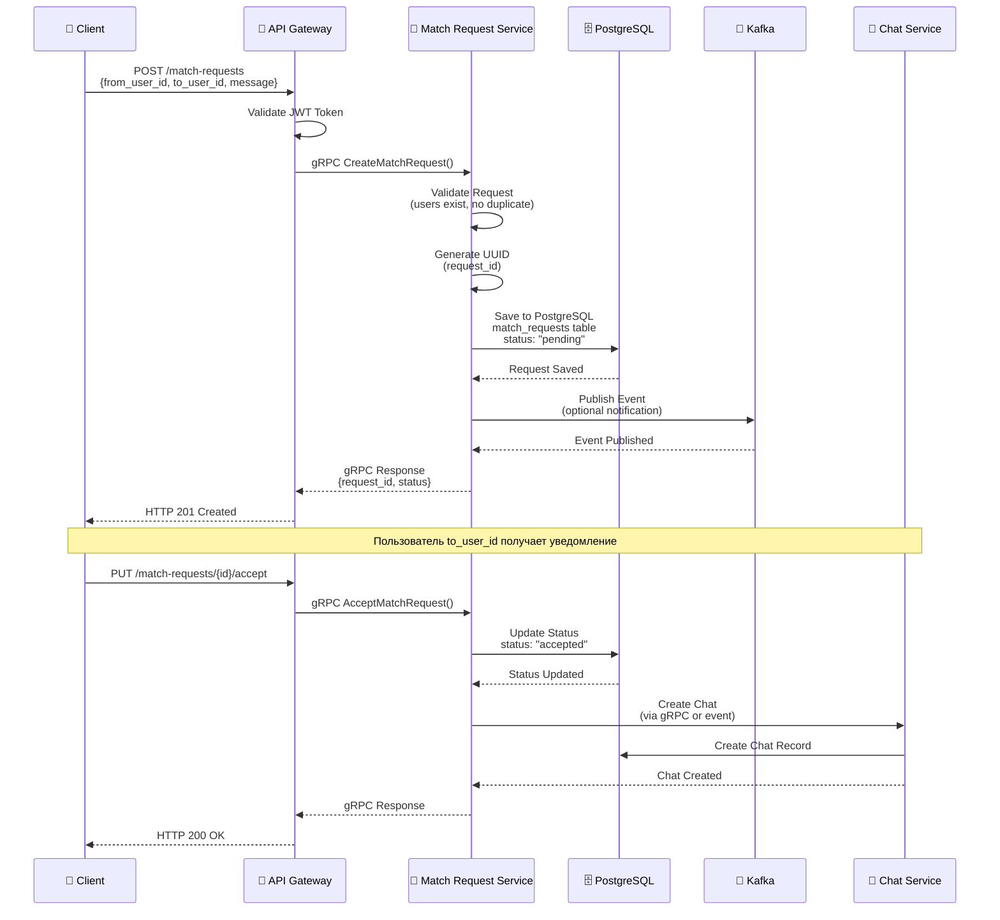
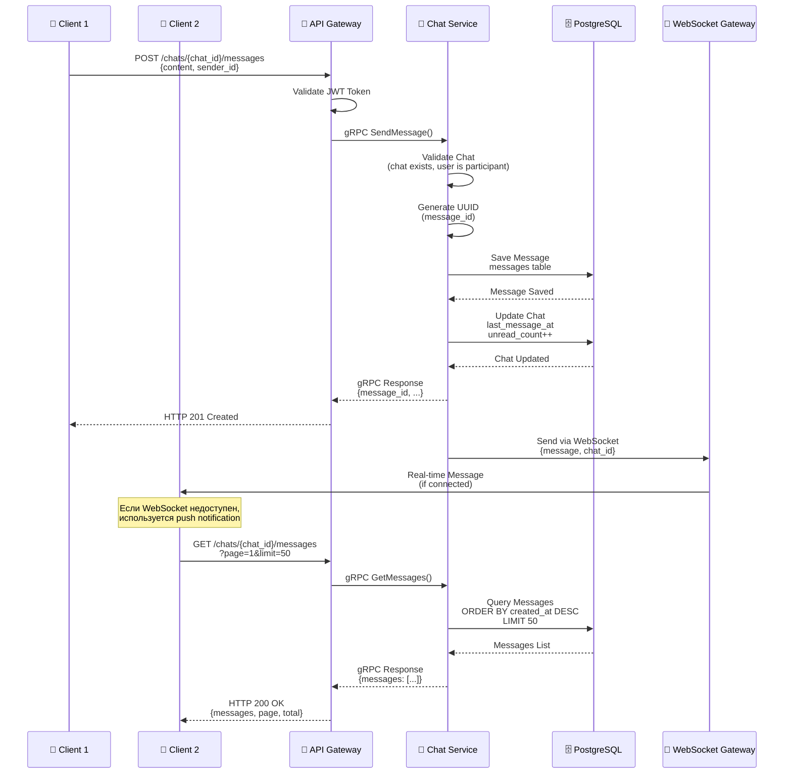
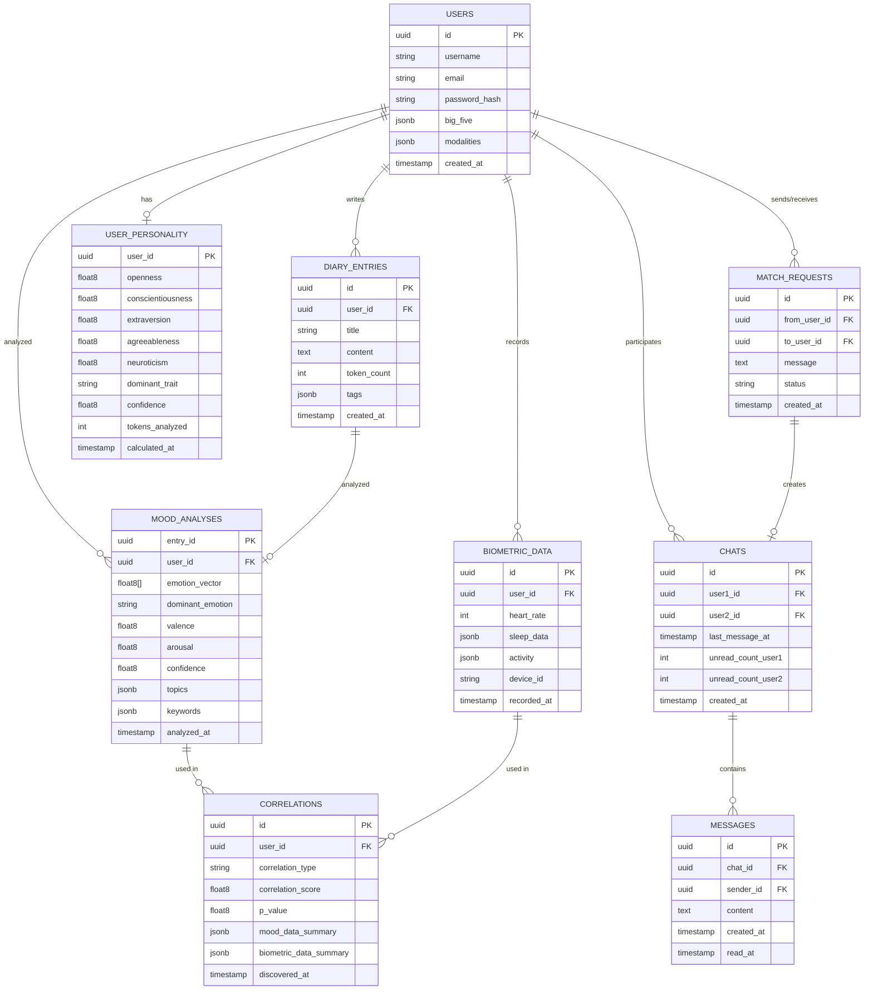

# MetaChat - Детальные Диаграммы Flow

## Общая архитектура системы



## Flow 1: Регистрация пользователя



## Flow 2: Создание записи в дневнике



## Flow 3: Анализ настроения (детальный)

```mermaid
flowchart TB
    subgraph Input["📥 Входные данные"]
        EVENT[Kafka Event<br/>diary.entry.created]
        PAYLOAD[Payload:<br/>diary_id, user_id,<br/>content, token_count]
    end

    subgraph Preprocessing["🔧 Предобработка"]
        CLEAN[Очистка текста<br/>Remove URLs<br/>Normalize spaces]
        TOKEN[Токенизация<br/>Tokenize text<br/>Count tokens]
        PREP[Подготовка для модели<br/>Create input tensors<br/>Padding/Truncation]
    end

    subgraph AIModel["🤖 AI Модель"]
        TRANS[Transformer Model<br/>HuggingFace<br/>cardiffnlp/twitter-roberta]
        SENT[Sentiment Analysis<br/>positive/neutral/negative<br/>Confidence score]
        PLUT[Plutchik Model<br/>8 базовых эмоций<br/>emotion_vector[8]]
        VA[Valence & Arousal<br/>Valence: -1 to +1<br/>Arousal: -1 to +1]
    end

    subgraph TopicExtraction["📊 Извлечение тем"]
        NLP[NLP Processing<br/>spaCy/NLTK]
        TOPICS[Topic Classification<br/>work, family, friends, etc.]
        KEYWORDS[Keyword Extraction<br/>TF-IDF analysis<br/>Stop words filtering]
    end

    subgraph Result["✅ Результат"]
        DOM[Доминирующая эмоция<br/>Max from emotion_vector]
        CONF[Confidence Score<br/>Model confidence]
        OUTPUT[Output JSON<br/>emotion_vector, valence,<br/>arousal, topics, keywords]
    end

    subgraph Storage["💾 Сохранение"]
        CASS[Save to Cassandra<br/>mood_analyses table]
        KAFKA[Publish to Kafka<br/>metachat.mood.analyzed]
    end

    EVENT --> PAYLOAD
    PAYLOAD --> CLEAN
    CLEAN --> TOKEN
    TOKEN --> PREP
    PREP --> TRANS
    TRANS --> SENT
    TRANS --> PLUT
    PLUT --> VA
    PAYLOAD --> NLP
    NLP --> TOPICS
    NLP --> KEYWORDS
    SENT --> DOM
    PLUT --> DOM
    DOM --> CONF
    CONF --> OUTPUT
    TOPICS --> OUTPUT
    KEYWORDS --> OUTPUT
    OUTPUT --> CASS
    OUTPUT --> KAFKA
```

## Flow 4: Определение личности Big Five (детальный)

```mermaid
flowchart TB
    subgraph Input["📥 Входные данные"]
        EVENT[Kafka Event<br/>mood.analyzed]
        MOOD[Emotion Data:<br/>emotion_vector, valence,<br/>arousal, topics]
    end

    subgraph Aggregation["📈 Агрегация данных"]
        LOAD[Загрузка истории<br/>All mood_analyses<br/>All diary_entries]
        AGG_EMO[Агрегация эмоций<br/>Weighted average<br/>0.7 * old + 0.3 * new]
        AGG_TOP[Распределение тем<br/>Topic frequency<br/>Normalization]
        COUNT[Подсчет токенов<br/>Sum token_count<br/>total_tokens]
    end

    subgraph Triggers["⚡ Проверка триггеров"]
        CHECK{Проверка условий}
        FIRST[Первый расчет?<br/>tokens >= 50]
        RECALC[Пересчет?<br/>tokens >= 100<br/>OR days >= 7]
        SKIP[Пропустить<br/>Обновить только<br/>агрегированные данные]
    end

    subgraph Calculation["🧮 Расчет Big Five"]
        O[Openness (O)<br/>surprise, anticipation<br/>creative topics<br/>text complexity]
        C[Conscientiousness (C)<br/>trust, work topics<br/>entry length<br/>positive valence]
        E[Extraversion (E)<br/>joy, surprise<br/>social topics<br/>high arousal]
        A[Agreeableness (A)<br/>trust, joy<br/>social topics<br/>low negative emotions]
        N[Neuroticism (N)<br/>fear, sadness, anger<br/>stress topics<br/>negative valence]
    end

    subgraph Result["✅ Результат"]
        DOM[Доминирующий фактор<br/>Max from [O,C,E,A,N]]
        CONF[Confidence<br/>Based on tokens,<br/>entries, consistency]
        SCORES[Big Five Scores<br/>O, C, E, A, N<br/>0.0 - 1.0]
    end

    subgraph Storage["💾 Сохранение"]
        CASS[Save to Cassandra<br/>user_personality]
        KAFKA[Publish to Kafka<br/>personality.assigned<br/>OR personality.updated]
        USER[Update User Service<br/>via Kafka event]
    end

    EVENT --> MOOD
    MOOD --> LOAD
    LOAD --> AGG_EMO
    LOAD --> AGG_TOP
    LOAD --> COUNT
    AGG_EMO --> CHECK
    AGG_TOP --> CHECK
    COUNT --> CHECK
    CHECK -->|First time| FIRST
    CHECK -->|Recalculation| RECALC
    CHECK -->|No trigger| SKIP
    FIRST -->|Yes| O
    RECALC -->|Yes| O
    O --> C
    C --> E
    E --> A
    A --> N
    N --> DOM
    DOM --> CONF
    CONF --> SCORES
    SCORES --> CASS
    SCORES --> KAFKA
    KAFKA --> USER
```

## Flow 5: Обработка биометрических данных



## Flow 6: Поиск корреляций (детальный)

```mermaid
flowchart TB
    subgraph Input["📥 Входные события"]
        MOOD_EVENT[Kafka: mood.analyzed]
        BIO_EVENT[Kafka: biometric.data.received]
    end

    subgraph Caching["💾 Кэширование"]
        MOOD_CACHE[Cache Mood Data<br/>Redis: mood_cache:{user_id}<br/>Last 30 records]
        BIO_CACHE[Cache Biometric Data<br/>Redis: biometric_cache:{user_id}<br/>Last 30 records]
    end

    subgraph Conditions["⚡ Проверка условий"]
        CHECK{Достаточно данных?}
        MIN_MOOD[Mood: >= 10 записей]
        MIN_BIO[Biometric: >= 14 дней]
        TIME_SYNC[Временное совпадение]
        SKIP[Пропустить анализ<br/>Только кэширование]
    end

    subgraph Analysis["📊 Статистический анализ"]
        SYNC[Синхронизация временных рядов<br/>Interpolation]
        HR_VAL[Heart Rate vs Valence<br/>Pearson correlation<br/>r, p-value]
        SLEEP_ARO[Sleep Quality vs Arousal<br/>Pearson correlation<br/>r, p-value]
        ACT_VAL[Activity vs Valence<br/>Pearson correlation<br/>r, p-value]
    end

    subgraph Validation["✅ Валидация"]
        SIG[Significance Check<br/>p-value < 0.05]
        STR[Strength Check<br/>|r| > 0.3]
        TYPE[Определение типа<br/>heart_rate_valence<br/>sleep_arousal<br/>activity_valence]
    end

    subgraph Result["💾 Сохранение"]
        CASS[Save to Cassandra<br/>correlations table]
        KAFKA[Publish to Kafka<br/>metachat.correlation.discovered]
    end

    MOOD_EVENT --> MOOD_CACHE
    BIO_EVENT --> BIO_CACHE
    MOOD_CACHE --> CHECK
    BIO_CACHE --> CHECK
    CHECK -->|Yes| MIN_MOOD
    CHECK -->|No| SKIP
    MIN_MOOD --> MIN_BIO
    MIN_BIO --> TIME_SYNC
    TIME_SYNC --> SYNC
    SYNC --> HR_VAL
    SYNC --> SLEEP_ARO
    SYNC --> ACT_VAL
    HR_VAL --> SIG
    SLEEP_ARO --> SIG
    ACT_VAL --> SIG
    SIG --> STR
    STR --> TYPE
    TYPE --> CASS
    TYPE --> KAFKA
```

## Flow 7: Подбор совместимых пользователей

```mermaid
flowchart TB
    subgraph Request["📥 Запрос"]
        CLIENT[Client Request<br/>GET /matching/recommendations<br/>?user_id=uuid&limit=10]
    end

    subgraph Load["📂 Загрузка данных"]
        USER_PROF[Load User Profile<br/>Cassandra: users_by_id]
        USER_PORT[Load User Portrait<br/>Cassandra: user_portraits<br/>big_five, emotions, topics]
        CANDIDATES[Load Candidates<br/>All active users<br/>With personality]
    end

    subgraph Similarity["🔍 Расчет схожести"]
        BF_SIM[Big Five Similarity<br/>Cosine Similarity<br/>[O,C,E,A,N] vectors]
        EM_SIM[Emotion Similarity<br/>Cosine Similarity<br/>emotion_vector avg]
        TOP_SIM[Topic Overlap<br/>Jaccard Index<br/>Topic sets]
    end

    subgraph Score["📊 Финальный счет"]
        WEIGHT[Weighted Combination<br/>0.4 * BF + 0.3 * EM + 0.3 * TOP]
        FINAL_SCORE[Final Similarity Score<br/>0.0 - 1.0]
    end

    subgraph Filter["🔽 Фильтрация"]
        SORT[Sort by Score<br/>Descending]
        THRESHOLD[Filter: score >= 0.3]
        EXCLUDE[Exclude existing<br/>match requests]
        LIMIT[Top N Results<br/>limit from request]
    end

    subgraph Response["✅ Ответ"]
        RESULT[JSON Response<br/>recommendations array<br/>with scores and details]
    end

    CLIENT --> USER_PROF
    CLIENT --> USER_PORT
    CLIENT --> CANDIDATES
    USER_PROF --> BF_SIM
    USER_PORT --> BF_SIM
    USER_PORT --> EM_SIM
    USER_PORT --> TOP_SIM
    CANDIDATES --> BF_SIM
    CANDIDATES --> EM_SIM
    CANDIDATES --> TOP_SIM
    BF_SIM --> WEIGHT
    EM_SIM --> WEIGHT
    TOP_SIM --> WEIGHT
    WEIGHT --> FINAL_SCORE
    FINAL_SCORE --> SORT
    SORT --> THRESHOLD
    THRESHOLD --> EXCLUDE
    EXCLUDE --> LIMIT
    LIMIT --> RESULT
```

## Flow 8: Создание запроса на общение



## Flow 9: Чат между пользователями



## Полный цикл: От записи до рекомендаций

```mermaid
graph LR
    subgraph Step1["1️⃣ Создание записи"]
        A[User writes entry] --> B[Diary Service]
        B --> C[Event Store]
        B --> D[Kafka: entry.created]
    end

    subgraph Step2["2️⃣ Анализ настроения"]
        D --> E[Mood Analysis Service]
        E --> F[AI: Sentiment + Plutchik]
        F --> G[Kafka: mood.analyzed]
    end

    subgraph Step3["3️⃣ Определение личности"]
        G --> H[Personality Service]
        H --> I[Aggregate Emotions]
        I --> J{Triggers?}
        J -->|Yes| K[Calculate Big Five]
        J -->|No| L[Update Aggregates]
        K --> M[Kafka: personality.updated]
    end

    subgraph Step4["4️⃣ Обновление профиля"]
        M --> N[User Service]
        N --> O[Update User Portrait]
        O --> P[Cassandra: user_portraits]
    end

    subgraph Step5["5️⃣ Подбор пользователей"]
        P --> Q[Matching Service]
        Q --> R[Calculate Similarity]
        R --> S[Recommendations]
    end

    Step1 --> Step2
    Step2 --> Step3
    Step3 --> Step4
    Step4 --> Step5

    style Step1 fill:#e3f2fd
    style Step2 fill:#fff3e0
    style Step3 fill:#f3e5f5
    style Step4 fill:#e8f5e9
    style Step5 fill:#fce4ec
```



## Kafka Topics и Consumer Groups

```mermaid
graph TB
    subgraph Producers["📤 Producers"]
        US_P[User Service]
        DS_P[Diary Service]
        MAS_P[Mood Analysis]
        PRS_P[Personality Service]
        BIO_P[Biometric Service]
        COR_P[Correlation Service]
    end

    subgraph Topics["📨 Kafka Topics"]
        T1[metachat-user-events]
        T2[metachat.diary.entry.created]
        T3[metachat.diary.entry.updated]
        T4[metachat.diary.entry.deleted]
        T5[metachat.mood.analyzed]
        T6[metachat.mood.analysis.failed]
        T7[metachat.personality.assigned]
        T8[metachat.personality.updated]
        T9[metachat.biometric.data.received]
        T10[metachat.correlation.discovered]
    end

    subgraph Consumers["📥 Consumers"]
        MAS_C[Mood Analysis<br/>Group: mood-analysis]
        PRS_C[Personality Service<br/>Group: personality-service]
        ANS_C[Analytics Service<br/>Group: analytics-service]
        COR_C[Correlation Service<br/>Group: correlation-service]
        ARCH_C[Archetype Service<br/>Group: archetype-service]
        US_C[User Service<br/>Group: user-service]
    end

    US_P --> T1
    DS_P --> T2
    DS_P --> T3
    DS_P --> T4
    MAS_P --> T5
    MAS_P --> T6
    PRS_P --> T7
    PRS_P --> T8
    BIO_P --> T9
    COR_P --> T10

    T2 --> MAS_C
    T3 --> MAS_C
    T2 --> PRS_C
    T5 --> PRS_C
    T2 --> ANS_C
    T4 --> ANS_C
    T5 --> ANS_C
    T8 --> ANS_C
    T5 --> COR_C
    T9 --> COR_C
    T5 --> ARCH_C
    T7 --> US_C
    T8 --> US_C
    T1 --> ANS_C
```



## Временная диаграмма полного цикла

```mermaid
gantt
    title Временная диаграмма: Создание записи → Рекомендации
    dateFormat X
    axisFormat %Ls

    section Синхронная часть
    Client Request           :0, 50
    API Gateway              :50, 100
    Diary Service            :100, 300
    Response to Client       :300, 50

    section Асинхронная часть
    Kafka Publish            :350, 50
    Mood Analysis Receive    :400, 50
    Mood Analysis Process    :450, 800
    Mood Analysis Publish    :1250, 50
    Personality Receive      :1300, 50
    Personality Aggregate    :1350, 200
    Personality Calculate    :1550, 200
    Personality Publish      :1750, 50
    User Service Update      :1800, 100
    Matching Service         :1900, 400
    Recommendations Ready    :2300, 0
```



## Схема базы данных (упрощенная)




