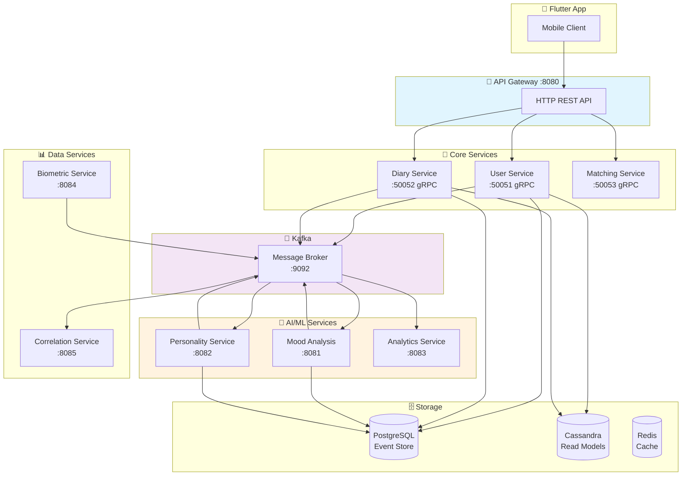
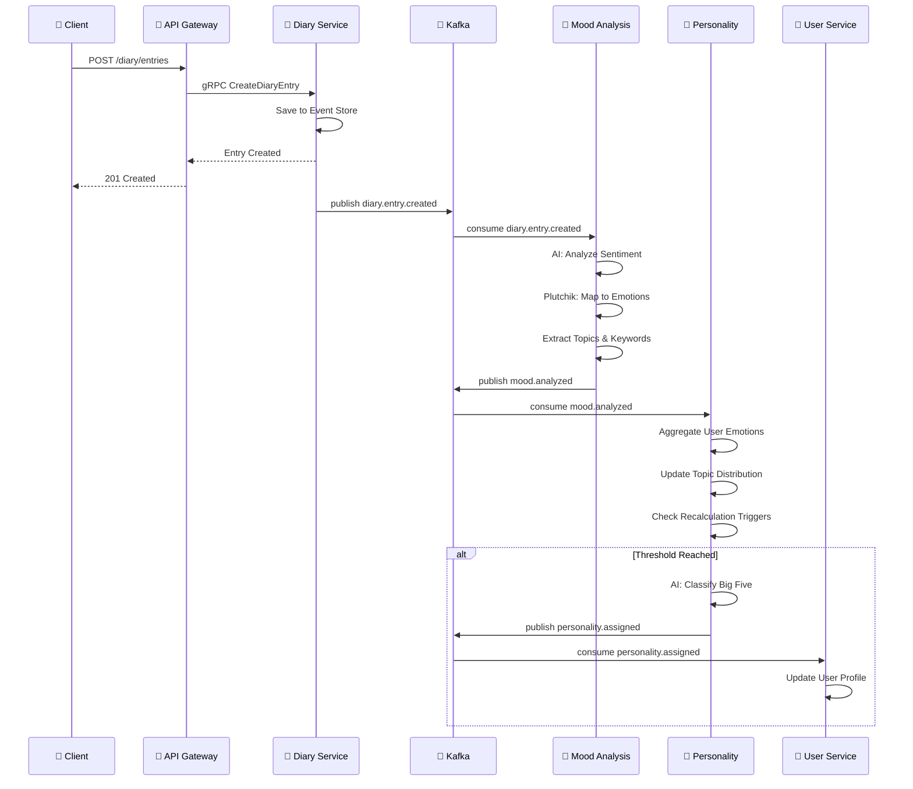
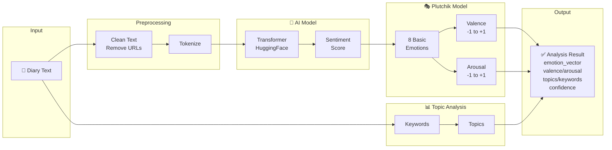
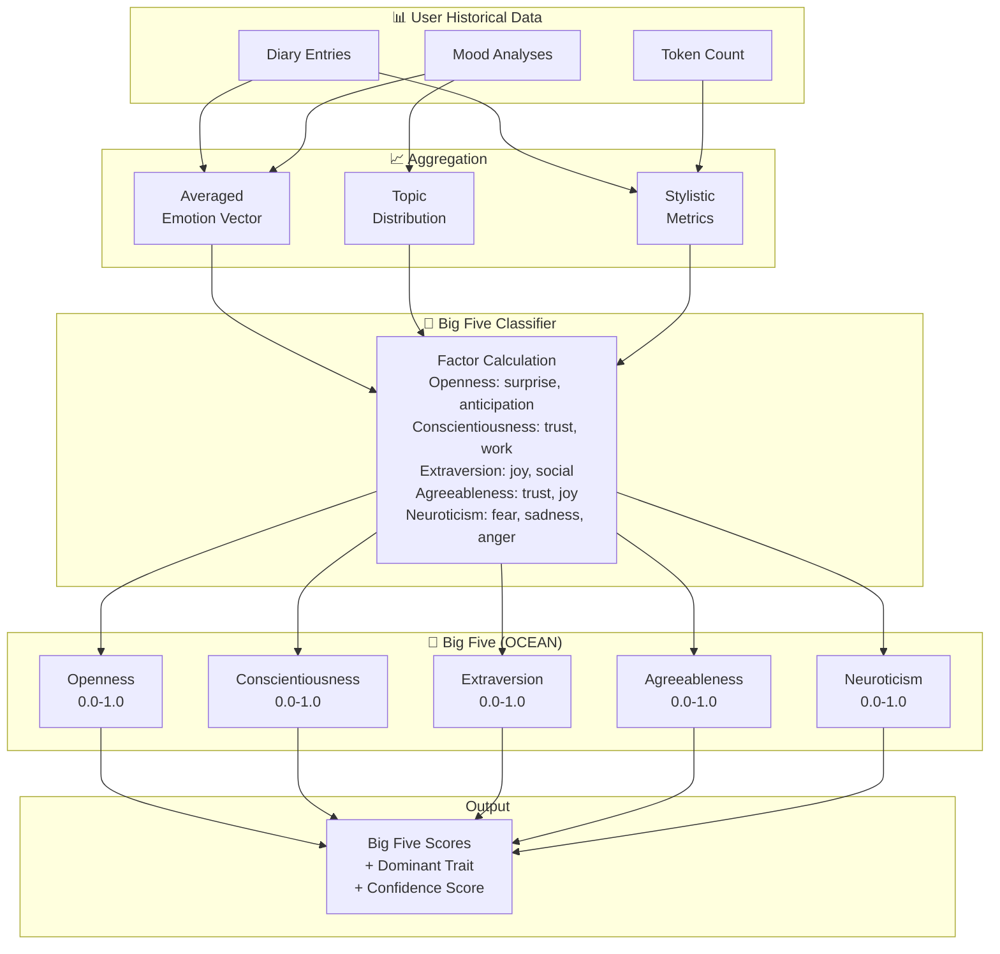
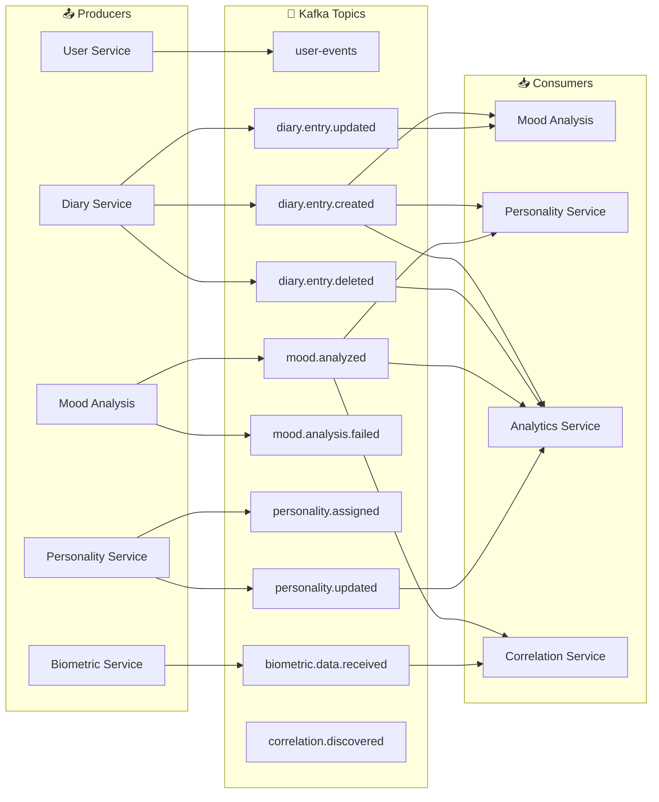
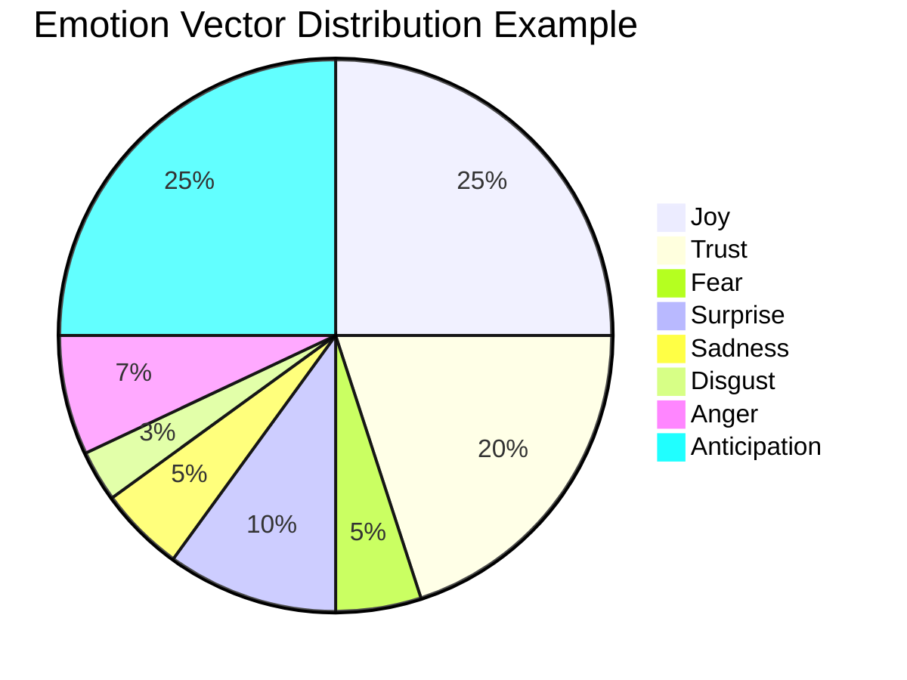
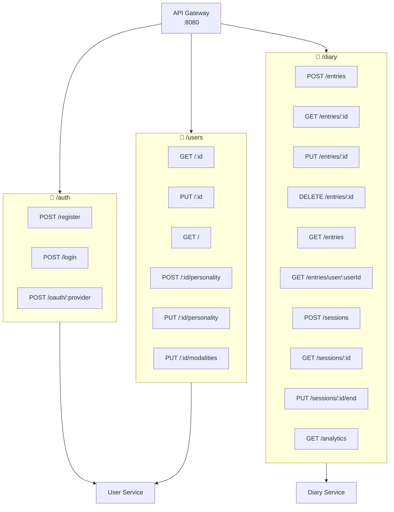
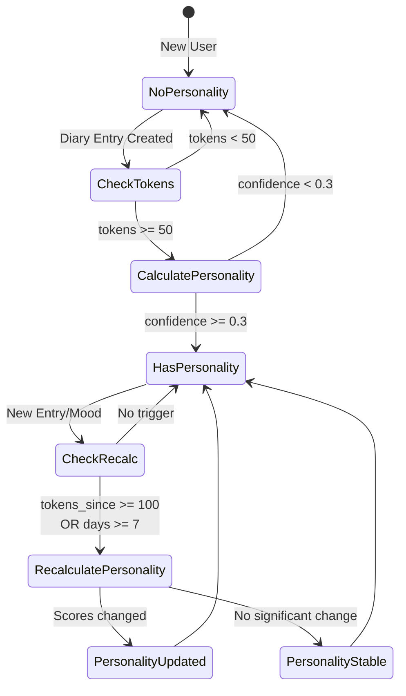
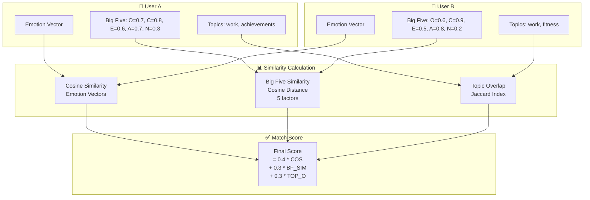

# MetaChat - Flow Diagrams (Mermaid)

> **📚 Для более детального описания flow с пошаговыми инструкциями, временными характеристиками и техническими деталями см. [DETAILED_SERVICE_FLOW.md](./DETAILED_SERVICE_FLOW.md)**  
> **📊 Для расширенных диаграмм со всеми деталями см. [DETAILED_FLOW_DIAGRAMS.md](./DETAILED_FLOW_DIAGRAMS.md)**

## Общая архитектура системы

## Поток создания записи в дневнике

## AI Pipeline - Mood Analysis

## AI Pipeline - Big Five Personality Classification

## Kafka Event Flow

## Plutchik Emotion Wheel

## API Routes Map

## Personality (Big Five) Triggers

## User Matching Algorithm

